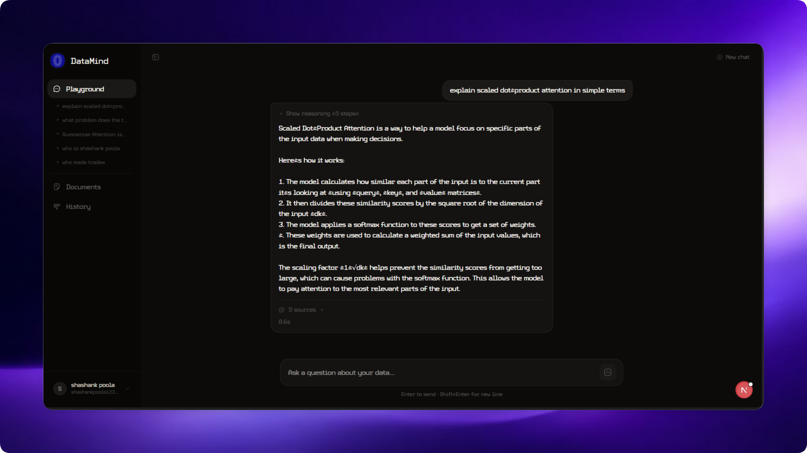

<p align="center">
  
</p>

<h1 align="center">DataMind</h1>

<h3 align="center">
  Open-Source Enterprise RAG Agent with Hybrid Retrieval
</h3>

<p align="center">
  📄 <a href="http://localhost:8000/docs">API Docs</a> · 🐙 <a href="https://github.com/shashank-poola/rag-agent">GitHub</a> · 📄 <a href="LICENSE">License</a>
</p>

<br/>

<p align="center">
  
</p>

<br/>

## What is DataMind?

DataMind is an open-source RAG (Retrieval-Augmented Generation) agent for enterprise document intelligence.

Upload your PDFs, CSVs, and text files. Ask questions in plain English. Get precise, source-backed answers in real time, powered by hybrid search, Cohere reranking, and a streaming reasoning UI that shows every step of its thinking.

Most RAG systems fail on real queries because semantic search alone is imprecise. DataMind combines BM25 keyword search with vector similarity, then runs a cross-encoder reranker over all candidates together — so retrieval is accurate for both meaning and exact terms like clause numbers, dates, and product codes.

## Key Features

For **developers and data teams**:

- 🔀 **Hybrid Retrieval** — BM25 + vector search run in parallel and merge via weighted ensemble. You get keyword precision and semantic understanding in every query.
- 🏆 **Cohere Reranking** — A cross-encoder reranker sees the full query alongside every retrieved chunk simultaneously, ranking by true relevance rather than isolated cosine similarity.
- 📂 **Multi-format Ingestion** — Upload PDFs, CSVs, and TXT files. Documents are chunked, indexed into ChromaDB, and immediately queryable.
- 🔒 **Auth + User Isolation** — JWT authentication with per-user document namespacing. No cross-user data leakage.
- 📊 **Analytics Dashboard** — Query history, usage patterns, and document indexing status tracked out of the box.

For **end users**:

- 🤖 **Natural Language Queries** — Ask questions in plain English, no SQL or search syntax required.
- 🧠 **Live Reasoning Steps** — Watch the agent think in real time: searching, reranking, generating. Each step streams as it happens.
- 📌 **Source Attribution** — Every answer includes the exact document chunks it was built from, with their rerank scores, so you can verify what you're reading.
- 🗑️ **Document Management** — Upload, track indexing status, and delete documents from a clean UI.

## ⚡️ Quickstart in 4 steps

- **Step 1**: Clone the repo

    ```bash
    git clone https://github.com/shashank-poola/rag-agent.git
    cd rag-agent
    ```

<br/>

- **Step 2**: Install dependencies

    **Backend** (requires Python 3.12+ and [uv](https://docs.astral.sh/uv/)):

    ```bash
    uv sync
    ```

    **Frontend** (requires Node.js 18+):

    ```bash
    cd web && npm install
    ```

<br/>

- **Step 3**: Configure environment variables

    Create `.env` in the project root:

    ```env
    # LLM — get from console.groq.com
    GROQ_API_KEY=your_groq_api_key
    LLM_MODEL=llama-3.3-70b-versatile

    # Embeddings — get from aistudio.google.com
    GEMINI_API_KEY=your_gemini_api_key
    EMBEDDING_MODEL=gemini-embedding-001

    # Reranking — get from cohere.com
    COHERE_API_KEY=your_cohere_api_key
    COHERE_RERANK_MODEL=rerank-english-v3.0

    # Vector Store — get from trychroma.com
    CHROMA_API_KEY=your_chroma_api_key
    CHROMA_TENANT=your_tenant
    CHROMA_DATABASE=your_database
    CHROMA_COLLECTION=your_collection

    # Auth
    SECRET_KEY=any_long_random_string_here
    ALGORITHM=HS256
    ACCESS_TOKEN_EXPIRE_MINUTES=30

    # Database (SQLite by default)
    DATABASE_URL=sqlite:///./datamind.db

    # Retrieval weights
    BM25_WEIGHT=0.4
    VECTOR_WEIGHT=0.6
    CHUNK_SIZE=1000
    CHUNK_OVERLAP=200
    ```

    Create `web/.env.local`:

    ```env
    NEXT_PUBLIC_API_URL=http://localhost:8000
    ```

<br/>

- **Step 4**: Run the app

    **Backend:**

    ```bash
    uv run python main.py
    # API at http://localhost:8000
    # Swagger docs at http://localhost:8000/docs
    ```

    **Frontend (new terminal):**

    ```bash
    cd web && npm run dev
    # UI at http://localhost:3000
    ```

## How It Works

```
Document Upload
      │
      ▼
  Chunking (1000 tokens, 200 overlap)
      │
      ├──► BM25 Index         (keyword precision)
      └──► ChromaDB Vectors   (semantic understanding via Gemini)
                        │
               Query comes in
                        │
              ┌─────────┴──────────┐
         BM25 (0.4)        Vector (0.6)
              └─────────┬──────────┘
                   Ensemble merge
                        │
               Cohere Reranker
               (cross-encoder: sees query + all chunks together)
                        │
              Groq LLM (Llama 3.3 70B)
                        │
          Streamed response + sources + latency
```

Retrieval quality matters more than model quality. A great model with bad retrieval gives bad answers. This architecture optimizes retrieval first.

## API Reference

| Method   | Endpoint                   | Description                       |
| -------- | -------------------------- | --------------------------------- |
| `POST`   | `/api/v1/auth/signup`      | Register new user                 |
| `POST`   | `/api/v1/auth/login`       | Login, returns JWT                |
| `GET`    | `/api/v1/documents`        | List uploaded documents           |
| `POST`   | `/api/v1/documents/upload` | Upload document (PDF / CSV / TXT) |
| `DELETE` | `/api/v1/documents/{id}`   | Delete document and its index     |
| `POST`   | `/api/v1/query/stream`     | Stream RAG query via SSE          |
| `GET`    | `/api/v1/analytics`        | Query analytics and history       |
| `GET`    | `/health`                  | Health check                      |

### SSE stream format

`POST /api/v1/query/stream` body: `{ "question": "...", "k": 5 }`

```
data: {"event": "thinking", "step": "retrieve",  "message": "Searching documents..."}
data: {"event": "thinking", "step": "rerank",    "message": "Reranking results..."}
data: {"event": "thinking", "step": "generate",  "message": "Generating response..."}
data: {"event": "sources",  "documents": [{ "content": "...", "document_name": "...", "rerank_score": 0.94 }]}
data: {"event": "token",    "content": "The contract states..."}
data: {"event": "done",     "latency_ms": 2341}
data: {"event": "error",    "message": "..."}
```

## 📒 Stack

### Backend

| Layer          | Technology                             | Why                                  |
| -------------- | -------------------------------------- | ------------------------------------ |
| LLM            | Groq — `llama-3.3-70b-versatile`       | Fast inference, strong reasoning     |
| Embeddings     | Google Gemini — `gemini-embedding-001` | High quality, multimodal-ready       |
| Vector Store   | ChromaDB Cloud                         | Managed, no infra to run             |
| Keyword Search | BM25 (`rank-bm25`)                     | Exact match, zero latency overhead   |
| Reranker       | Cohere — `rerank-english-v3.0`         | Cross-encoder, context-aware ranking |
| Framework      | FastAPI + LangChain + SQLAlchemy       | Fast, typed, composable              |
| Auth           | JWT (`python-jose`)                    | Stateless, standard                  |

### Frontend

| Layer     | Technology                          |
| --------- | ----------------------------------- |
| Framework | Next.js 16 + React 19               |
| Styling   | Tailwind CSS v4                     |
| Client    | Typed fetch + SSE stream parser     |

## 📄 Supported Formats

| Format | Notes                      |
| ------ | -------------------------- |
| `.pdf` | Multi-page text extraction |
| `.csv` | Row-level chunking         |
| `.txt` | Plain text chunking        |

## ⛹️‍♀️ Join the Community

- Star the repo to stay updated
- Open an issue for bugs or feature requests
- Fork and contribute — PRs are welcome

## 📄 License

This project is licensed under the MIT License — see the [LICENSE](LICENSE) file for details.
